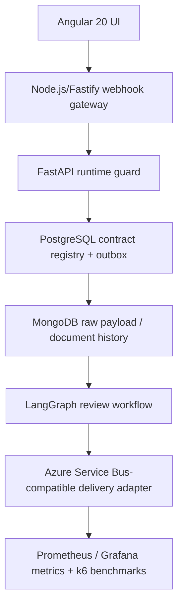

# DRIFTGATE

DRIFTGATE is an API contract governance and runtime reliability platform built around a single pipeline:



## Tech Stack

- Angular 20 UI for the operator console
- Node.js and Fastify for HMAC-verified webhook ingress and idempotency
- FastAPI runtime guard for live payload tracking and drift classification
- PostgreSQL for the contract registry, version history, subscriptions, and transactional outbox
- MongoDB for raw payload captures, diff evidence, validation errors, and document history
- LangGraph for grounded contract review workflows
- Azure Service Bus-compatible delivery adapter for drift-event delivery
- Prometheus and Grafana for metrics and dashboards
- k6 for load and benchmark runs

## Services

- `frontend/`: Angular 20 control room
- `gateway/`: Node.js/Fastify webhook gateway
- `app/`: FastAPI runtime guard, review workflow, event publishing, and document-store integration
- `backend/`: scheduled monitor and changelog service

## Quickstart

```bash
docker compose up -d --build
curl -X POST http://localhost:8301/api/monitor/run-once \
  -H "X-DRIFTGATE-ADMIN-SECRET: dev-secret"
```

- Frontend: `http://localhost:5173/`
- Monitor API: `http://localhost:8301`
- Runtime guard API: `http://localhost:8302`
- Gateway: `http://localhost:8303`

## Runtime Behavior

- Webhook ingress is verified with HMAC and idempotency checks in the gateway.
- The runtime guard records payload snapshots, schema diffs, validation failures, and review evidence.
- PostgreSQL stores registry metadata and outbox state.
- MongoDB stores raw payload documents and history.
- LangGraph powers the contract review workflow.
- The delivery adapter can target an Azure Service Bus-compatible sender.
- Metrics are exposed for Prometheus and visualized in Grafana.
- k6 benchmarks are captured as JSON artifacts under `docs/benchmarks/`.

## Local Development

```bash
docker compose up -d --build
```

Useful environment defaults:

- `EVENT_BACKEND=noop` for local development
- `EVENT_BACKEND=kafka` when a Kafka producer is injected
- `EVENT_BACKEND=azure_service_bus` when an Azure Service Bus sender is injected
- `DOCUMENT_STORE_BACKEND=memory` for tests and minimal local mode
- `DOCUMENT_STORE_BACKEND=mongo` with `DOCUMENT_STORE_URI=mongodb://mongo:27017` for local MongoDB

## Notes

- The repository uses the `DRIFTGATE` project name throughout the codebase.
- Benchmarks, simulations, and generated artifacts live in JSON or code form instead of markdown docs.
- The architecture is designed to be local-first and cloud-compatible without requiring cloud deployment.
