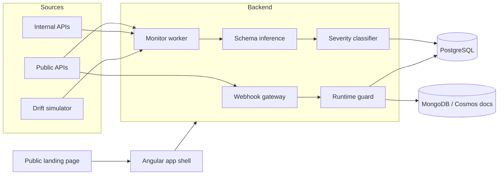

# DriftGate

DriftGate tracks JSON API contract drift.

This repository currently contains three runtime services:

- `backend/`: scheduled API monitor and changelog service
- `gateway/`: Node.js/TypeScript webhook gateway with HMAC and idempotency checks
- root `app/`: runtime contract guard, webhook outbox, and drift event pipeline
- `frontend/`: Angular product site and application console for registry, drift review, DLQ, and document-store browsing

It has two paths:

1. Scheduled drift monitoring for live endpoints.
2. Runtime contract guarding for payload samples submitted by middleware.

## What it does

- Infers schemas from observed payloads
- Computes deterministic schema hashes
- Diffs schema changes and classifies severity
- Persists snapshots and violations
- Stores payload snapshots, schema diffs, validation errors, and replay artifacts in a MongoDB-compatible document store
- Powers a dashboard for triage and history
- Supports an event-backend abstraction for drift publishing

## Architecture



## Frontend routes

- `/` public product landing page
- `/app/overview` governance control center
- `/app/registry` schema registry and ownership
- `/app/diffs` schema drift viewer
- `/app/reliability` webhook retries and DLQ replay
- `/app/documents` payload and diff history
- `/app/review` contract review workflow

## Local run

```bash
docker compose up -d --build
curl -X POST http://localhost:18080/api/monitor/run-once \
  -H "X-SCHEMAPILOT-ADMIN-SECRET: dev-secret"
```

## Runtime guard

The runtime guard exposes a `POST /track` endpoint for live payload samples and a metrics endpoint for counts.
It also writes payload snapshots and drift documents to the document store configured by `DOCUMENT_STORE_BACKEND`.

Runtime event delivery is environment driven:

- `EVENT_BACKEND=noop` for local development
- `EVENT_BACKEND=kafka` when a Kafka producer is injected
- `EVENT_BACKEND=azure_service_bus` when an Azure Service Bus sender is injected
- `DOCUMENT_STORE_BACKEND=memory` for tests and minimal local mode
- `DOCUMENT_STORE_BACKEND=mongo` with `DOCUMENT_STORE_URI=mongodb://mongo:27017` for local MongoDB or Cosmos-compatible deployments

The code is structured for Azure-ready deployment, but cloud resources are optional and not required for local runs. See [docs/AZURE_DEPLOYMENT.md](docs/AZURE_DEPLOYMENT.md) for what "Azure-ready" does and doesn't mean here.

## Documentation

- [docs/ARCHITECTURE.md](docs/ARCHITECTURE.md) — system design and data paths
- [docs/LOCAL_DEVELOPMENT.md](docs/LOCAL_DEVELOPMENT.md) — running each service locally
- [docs/AZURE_DEPLOYMENT.md](docs/AZURE_DEPLOYMENT.md) — Azure-ready event backend and Cosmos-compatible document store notes (not deployed)
- [docs/FAILURE_MODES.md](docs/FAILURE_MODES.md) — how each component behaves on failure
- [docs/BENCHMARKS.md](docs/BENCHMARKS.md) — measured k6 load test results
- [DEPLOY.md](DEPLOY.md) — free-tier deploy guide (Neon + Cloud Run + Vercel)

## Portfolio Proof

- Architecture and evaluation: [docs/PORTFOLIO_PROOF.md](docs/PORTFOLIO_PROOF.md)
- Demo and local mode: use the Docker Compose command above
- Test commands: `pytest`, `npm run build`, `docker compose config`, `cd gateway && npm test`, `cd frontend && npm test -- --watch=false --browsers=ChromeHeadless`
- Evidence: benchmark and regression docs under `docs/`
